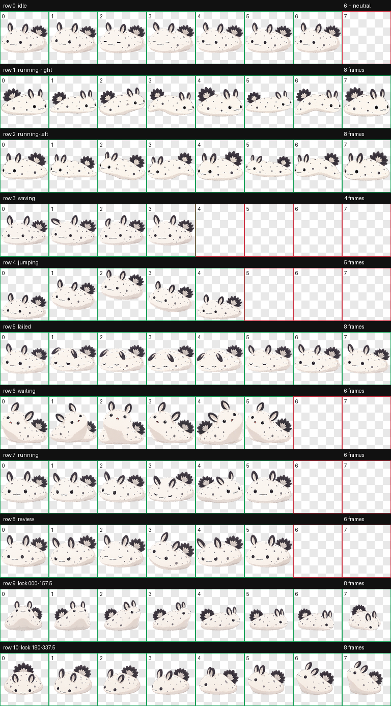
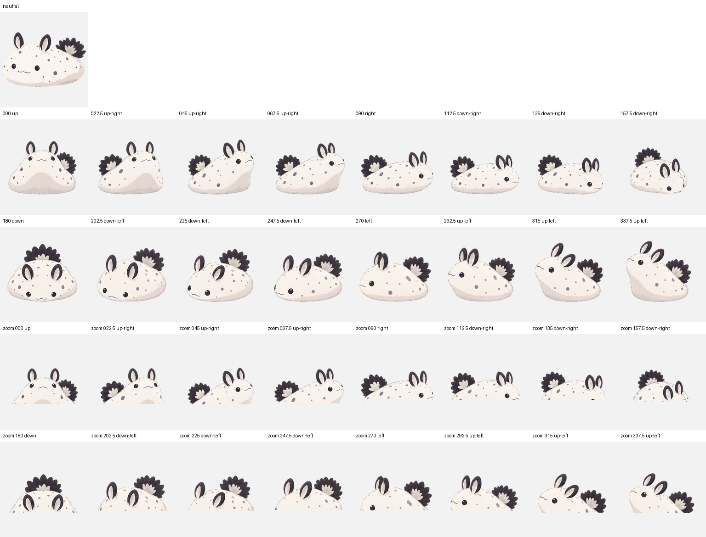

# Fushi Codex Pet

Fushi 是一只奶白色斑点海蛞蝓桌面宠物，基于 [原始设定图](fushi-settings.png) 制作。

## 下载与安装

当前版本：**[V2](https://github.com/hatrd/fushi-codex-pet/tree/V2)** · [下载安装包](https://github.com/hatrd/fushi-codex-pet/raw/refs/tags/V2/dist/fushi-v2.zip)

1. 解压安装包，把 `fushi` 文件夹复制到 `%USERPROFILE%\.codex\pets\`。
2. 在桌面 App 的外观设置中选择 **Fushi V2**。如仍显示旧图，重新打开 App。

也可以直接使用仓库中的 [`dist/fushi-v2/fushi`](dist/fushi-v2/fushi)。该目录含 `pet.json` 和 `spritesheet.webp`，两者须放在一起。

## 版本

| 标签 | 内容 | 安装包 |
| --- | --- | --- |
| [V1](https://github.com/hatrd/fushi-codex-pet/tree/V1) | 保留原版，提交 `b120e5e` | [fushi-pet.zip](https://github.com/hatrd/fushi-codex-pet/raw/refs/tags/V1/dist/fushi-pet.zip) |
| [V2](https://github.com/hatrd/fushi-codex-pet/tree/V2) | 从设定图全新生成，9 组动作与 16 个视线方向 | [fushi-v2.zip](https://github.com/hatrd/fushi-codex-pet/raw/refs/tags/V2/dist/fushi-v2.zip) |

V2 使用 `spriteVersionNumber: 2`，精灵图为 1536×2288 无损 WebP，每格 192×208。通过结构、透明背景及独立视觉检查，三份独立盲测的 28 个方向轴判断全部通过。部分方向间隔稍不均匀，已作为轻微视觉警告记录。

生成工具：hatch-pet + 内置 ImageGen。验收记录位于 [`docs/v2`](docs/v2)。

## 预览

